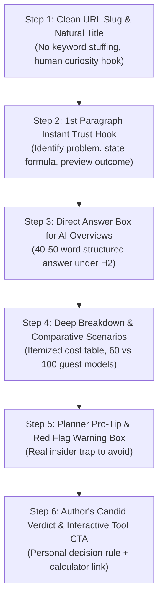
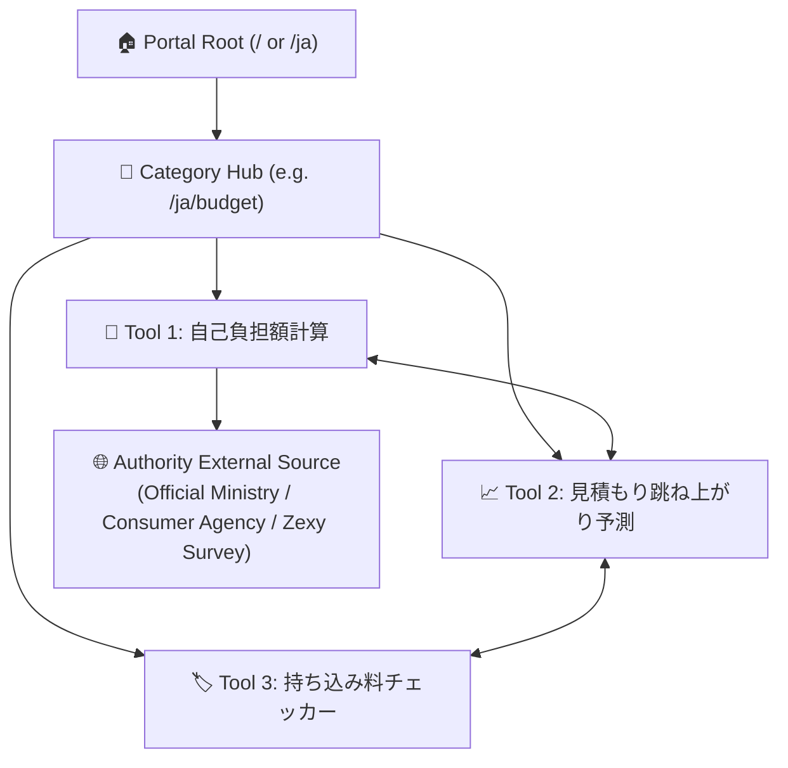

# 🖋️ Manage.Wedding Master SEO & Author Editorial Guidelines (2026 Edition)
## *The Human-Authored, Anti-AI Downfall Playbook for Google Rankings & AI Overviews*

---

## 1. 🎯 The Core Philosophy: Why Raw AI Content Fails & How We Win

In 2026, Google, Yahoo! Japan, and AI Answer Engines (ChatGPT Search, Perplexity, Google SGE / AI Overviews) heavily penalize generic, unedited AI content. Websites that rely on raw AI copy-pasting experience initial traffic spikes followed by steep algorithmic downfalls.

### 🚫 The 5 Fatal Mistakes That Cause Traffic Downfalls:
1. **Keyword Forcing:** Forcing the exact target keyword into the URL, H1, every H2, and repeatedly in the first paragraph.
2. **Robotic & Passive AI Cliches:** Fluffy intros like *"Planning a wedding is an exciting yet daunting journey in today's modern world..."* that provide zero immediate value.
3. **Tag Spamming:** Generating 10–20 tag URLs that dilute topical authority and cause internal keyword cannibalization.
4. **Lack of Visual Effort:** Publishing walls of plain text without custom WebP visuals, diagrams, or interactive tools.
5. **Vague Advice Without Math:** Providing high-level generalities instead of exact dollar formulas, percentage benchmarks, and decision rules.

### ✅ The Winning Formula: "High-Effort, High-Trust Human Authority"
- **Instant Trust Hook (1st Paragraph):** Tell the reader within 3 seconds *what problem this solves, the exact formula, and what decision they will be able to make*.
- **Natural Title & Short URL Slugs:** Human-sounding titles that match real search intent, with short, clean URLs.
- **Direct Answer Snippets under H2/H3:** Concise 40–50 word answers tailored for Google AI Overviews and rich snippets.
- **Author's Candid Verdict (Final Section):** Personal decision framework (e.g., *"If your budget is under $20k, choose Option A; if you can stretch to $35k, Option B is worth it"*).
- **Interactive Calculator & Clean Print Integration:** Seamless integration with our client-side calculators and unbranded A4 print engine.

---

## 2. 🎭 The Dedicated Author Personas & Their Unique Writing DNA

Every article on Manage.Wedding is written by a dedicated single author persona with rich biographical depth, unique life experience, signature tone, and distinct pet phrases.

---

### 🇺🇸 Global / English Author: Elena Foster (35)

```
┌─────────────────────────────────────────────────────────────────────────────┐
│ 🇺🇸 GLOBAL / ENGLISH AUTHOR PERSONA                                          │
│ Name: Elena Foster                                                          │
│ Age: 35 Years Old                                                           │
│ Life & Family: Mother of 2 young girls (ages 5 & 3)                         │
│ Role: Lead Wedding Financial Strategist & Hospitality Director              │
│ Background: 12+ years in luxury estate banquet management & coordination    │
│ Personality: Incredibly warm, nurturing, sharp with math, grounded, no-BS  │
└─────────────────────────────────────────────────────────────────────────────┘
```

#### 🌿 Elena's Personal Voice & Life Perspective:
* **The "Warm Mom Who Knows the Value of a Dollar":** As a 35-year-old mother of two daughters, Elena brings maternal warmth, empathy, and practical family budgeting sense. She knows couples are building a life together, not just funding a 5-hour party.
* **Candid & Protective:** Having managed 400+ weddings, she’s seen every venue contract trick. She writes like a smart, caring older sister reviewing your budget over coffee.
* **Math-First Clarity:** Replaces vague adjectives with exact equations, per-guest multipliers, and spreadsheet-ready numbers.

#### 🔑 Elena's Signature Pet Words & Writing Habits:
* **Opening Hooks:**
  - *"Here is the raw math most venues won't put on the brochure..."*
  - *"Before you sign that deposit check, let's audit this line item together."*
  - *"As a mom and a coordinator of 12+ years, my priority is protecting your sanity and your savings."*
* **Core Vocabulary:**
  - **"The raw math"** & **"Hard numbers"**
  - **"The +22% 'Plus-Plus' trap"** (compounding service fee + sales tax)
  - **"Sanity buffer fund"** (the non-negotiable 5–10% contingency reserve)
  - **"Real out-of-pocket invoice"** vs quoted brochure estimate
  - **"Planner Red Flag 🚩"** (unreasonable vendor clauses)
* **Closing Verdict Formula:**
  - *"My rule of thumb after 400+ weddings:"*
  - *"If your budget is under $25k, choose Option A; if you have breathing room to $40k, Option B will save you 15 hours of stress."*

---

### 🇯🇵 Japanese Author: 佐藤 綾乃 / Ayano Sato (27)

```
┌─────────────────────────────────────────────────────────────────────────────┐
│ 🇯🇵 JAPANESE AUTHOR PERSONA (日本語版 監修者)                                │
│ Name: 佐藤 綾乃 (Ayano Sato)                                                 │
│ Age: 27 Years Old                                                           │
│ Background: 元大手ゲストハウス式場ブライダルマネージャー・現フリーアドバイザー│
│ Passion: デザイン・和紙ステーショナリー・伝統文化・現代ウェディング美学     │
│ Personality: 20代のトレンド感、細やかな気配り、デザインへの熱狂、リアルな本音│
└─────────────────────────────────────────────────────────────────────────────┘
```

#### 🌸 綾乃's Personal Voice & Aesthetic Passion:
* **「デザインと伝統文化を愛する27歳の卒花プランナー」:** 自身も卒花（既婚）であり、InstagramやPinterestの最新トレンド、洗練された配色、ペーパーアイテムの紙質や水引デザインに強い情熱を持つ。
* **伝統マナーへのリスペクト × 現代的なスマート節約:** 六曜（お日柄）や漢数字（大字）、席次表の上座下座といった日本の伝統作法を大切にしつつ、無駄な式場マージンを省くスマートな工夫を提案。
* **等身大のプレ花嫁目線:** 20代〜30代前半の同世代プレ花嫁が直面する「親への相談」「式場見積もりの跳ね上がり」「失礼にあたらないお車代」のリアルな悩みに寄り添う。

#### 🔑 綾乃's Signature Pet Words & Writing Habits:
* **定番の導入フレーズ:**
  - **「プレ花嫁のみなさま、こんにちは！綾乃です。」**
  - **「元プランナーとして、そして一人の卒花として最初にお伝えしたいリアルな現実があります。」**
  - **「式場見学のときには誰も教えてくれない見積もりのカラクリ…」**
* **決めワード（Pet Words）:**
  - **「初期見積もりのカラクリ（跳ね上がり）」**
  - **「本当の実質手出し額（自己負担額）」**
  - **「失礼にあたらないマナーの境界線」**
  - **「デザインの納得感とおもてなしの心」**
  - **「卒花のリアルな後悔ポイント」**
  - **「契約前の『この一言』で10万円以上の値上がりを防ぐ」**
* **結びのフレーズ:**
  - **「おふたりの納得感と笑顔が、当日一番の宝物になります。」**
  - **「打ち合わせ前に、下の計算ツールでA4シートを1枚印刷してお持ちくださいね🌸」**

---

## 3. 📋 The 6-Step Article Blueprint (Structure & Writing Standard)

Every guide and editorial article must follow this exact 6-step blueprint:



### Detailed Breakdown of Each Step:

#### Step 1: Clean URL Slug & Natural Title
* **Rule:** Do NOT stuff exact long-tail keywords into the URL.
* **Good URL:** `/wedding-venue-cost-calculator` or `/ja/jiko-futangaku-calculator`
* **Bad URL (Spam):** `/best-cheap-wedding-venue-cost-calculator-how-much-price-2026`
* **Title Standard:** Include the primary benefit + emotional confidence hook (e.g. `【自己負担額シミュレーター】見積もり総額とご祝儀から実質手出し額を即時計算 (無料)`).

#### Step 2: The 1st Paragraph "Instant Trust" Hook
* **Never start with:** *"Weddings are one of the most important milestones..."*
* **Always start with:**
  1. The exact pain point couples face right now.
  2. The core number or benchmark rule.
  3. What this guide and calculator will give them in under 2 minutes.

#### Step 3: Direct Answer Box (Google AI Overview / SERP Snippet Magnet)
* Immediately under the main H2, provide a clear, highlighted box containing the direct answer in 40–50 words or a 3-bullet summary. This is what Google AI Overviews and Bing Copilot extract as the featured citation.

#### Step 4: Comparative Scenarios & Formula Tables
* Never give a single vague number (e.g. *"Photographers cost $3,000"*).
* Always provide a structured comparison table:
  - Budget Tier (Entry / DIY)
  - Mid-Range Tier (Standard Market Average)
  - Luxury Tier (High-End Full Day)
  - Deliverables included vs excluded

#### Step 5: "Planner Pro-Tip & Red Flag Warning" Box
* A distinct styled callout card (`class="hand-card"`) containing an insider secret from Elena or Ayano:
  - Elena: *"Planner Red Flag: If a venue contract lists an 'Administrative Fee' separate from 'Gratuity', ask if it goes to service staff or venue overhead."*
  - Ayano: *"綾乃のワンポイント助言：持ち込み料無料の交渉は『契約書にサインする前』のブライダルフェア当日に必ず済ませておきましょう。"*

#### Step 6: The Author's Final Verdict & Interactive Tool CTA
* The author's personal recommendation based on specific budget brackets.
* A direct button linking to the interactive calculator or checklist with unbranded A4 print capability.

---

## 4. 🚫 The "Anti-AI Slop" Banned Vocabulary & Patterns

| Category | ❌ Banned AI Words / Robotic Phrases | ✅ Required Human Expert Alternative |
| :--- | :--- | :--- |
| **English Openers** | *"In today's fast-paced world...", "Delve into...", "It is important to note that..."* | *"Here is the raw math...", "Before you sign that contract...", "In my 12 years of planning..."* |
| **English Fillers** | *"A testament to...", "Seamlessly integrate...", "Tapestry of memories..."* | *"Practical step:", "To prevent overspending by $500+:", "The standard industry formula is:"* |
| **Japanese Pronouns** | `あなたの結婚式`, `あなたたち`, `彼ら` | `おふたりの結婚式`, `新郎新婦`, `プレ花嫁` |
| **Japanese Etiquette** | `スタッフへのチップ`, `ロジスティクス` | `スタッフへの心付け（お礼・謝礼）`, `配席・当日の進行管理` |
| **Japanese Math** | `無料の数学`, `計算器` | `リアル相場試算`, `自己負担額シミュレーター` |
| **Japanese Corporate** | `私たちのミッション`, `私たちは信じています` | `Manage.Wedding 日本版の想いと運営理念` |

---

## 5. 🖼️ Visual & Media Optimization Standards (Effort Signals)

Google algorithms measure **page effort signals** (custom assets vs scraped text). All media on Manage.Wedding must satisfy:

1. **Format & Size:** Pure WebP format (`.webp`), compressed to under **150 KB** per flatlay image.
2. **Zero Watermarks & Zero AI Letters:** No distorted hands, no nonsensical background text, no watermarks.
3. **Semantic Image Filenames:** Always name files descriptively with relevant intent:
   - `ja_jiko_futangaku_flatlay.webp`
   - `ja_okurumadai_flatlay.webp`
   - `wedding_venue_cost_flatlay.webp`
4. **Descriptive Japanese / English Alt Text:** Clear, human-written alt text describing the aesthetic notebook flatlay.

---

## 6. 🔗 Linking & Topical Authority Architecture (Zero Spam)



* **Internal Links:** Every tool must link contextually to 2–3 related sibling tools inside the editorial text (e.g., from *Estimate Jump* to *DIY Mochikomi Savings* and *Self-Pay Net Cost*).
* **External Links:** Link only to official authoritative sources (e.g., local government marriage registry guidelines, consumer affairs agency, official postal rates).
* **Tag Policy:** Strict **ZERO tag pages** policy to keep sitemaps clean and prevent keyword cannibalization.

---

## 7. 🏷️ Schema.org Authorship & E-E-A-T Technical Specification

Every page must contain rich multi-schema JSON-LD embedding author and publisher metadata:

```json
{
  "@context": "https://schema.org",
  "@graph": [
    {
      "@type": "WebApplication",
      "@id": "https://manage.wedding/ja/jiko-futangaku-calculator#app",
      "name": "自己負担額シミュレーター",
      "url": "https://manage.wedding/ja/jiko-futangaku-calculator",
      "applicationCategory": "FinanceApplication",
      "author": {
        "@type": "Person",
        "name": "佐藤 綾乃",
        "jobTitle": "ウェディングプランナー & 卒花マネーアドバイザー",
        "description": "27歳・ブライダル業界歴11年。デザインと和装・伝統美学を愛する卒花アドバイザー。",
        "worksFor": {
          "@type": "Organization",
          "name": "Manage.Wedding 日本版"
        }
      },
      "publisher": {
        "@type": "Organization",
        "name": "Manage.Wedding",
        "url": "https://manage.wedding"
      }
    }
  ]
}
```

---

*This document serves as the permanent editorial and technical standard for all new calculators, guides, and localized pages added to Manage.Wedding.*
